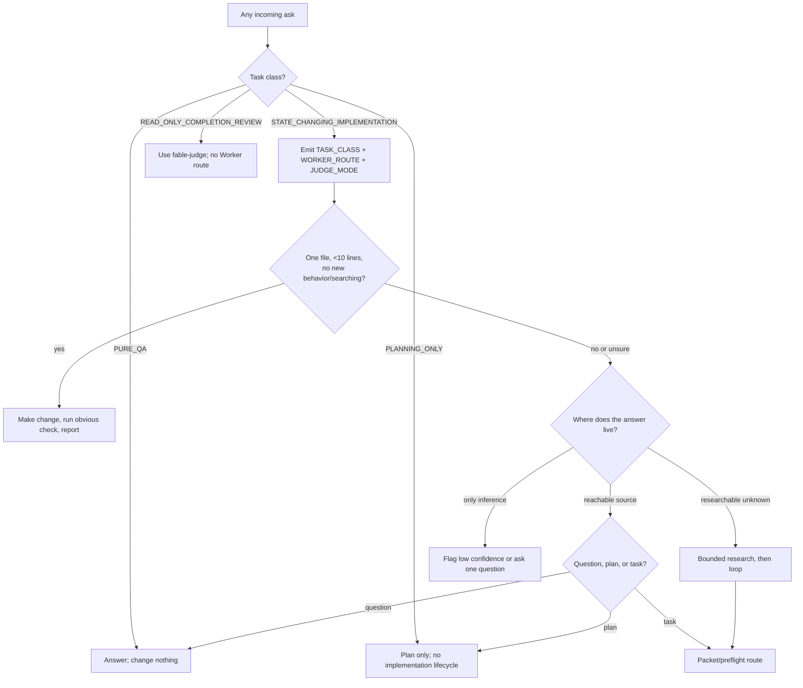
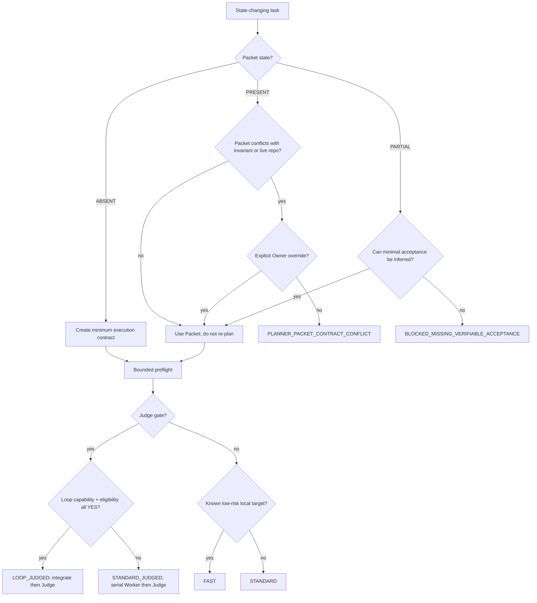
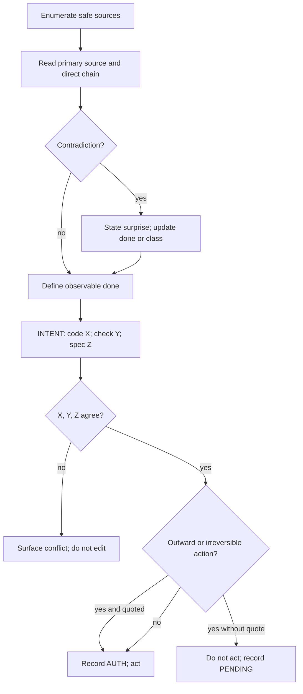
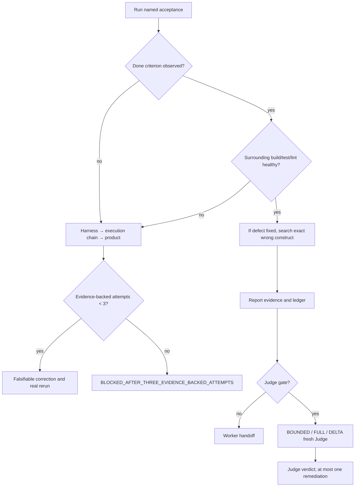
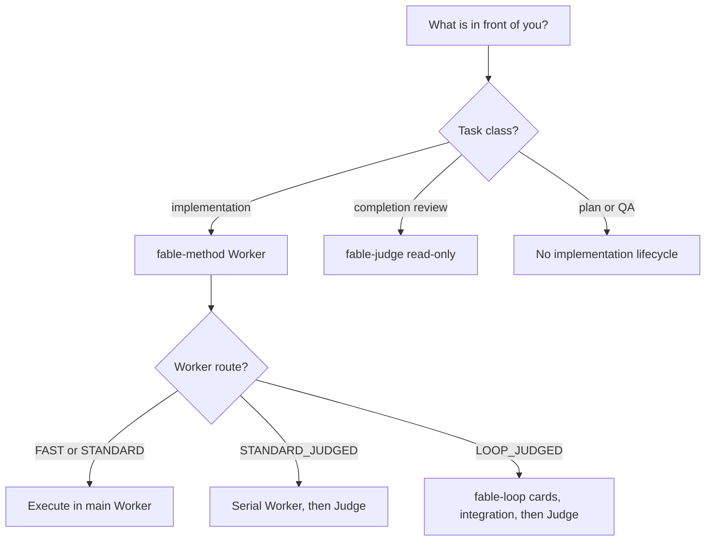

# The workflow, drawn

## Contents

1. [Master router](#1-master-router)
2. [Packet and route router](#2-packet-and-route-router)
3. [Evidence and intent gates](#3-evidence-and-intent-gates)
4. [Verification and Judge](#4-verification-and-judge)
5. [Family router](#5-family-router)

These charts are executable summaries. Diamonds are decisions that require
observation; they do not add rules beyond `SKILL.md` and the linked references.

## 1. Master router

If evidence disproves the initial task class, emit `TASK_CLASS_RECLASSIFIED`
with `FROM`, `TO`, `EVIDENCE`, and `IMPACT_ON_ROUTE` before switching branches.

## 2. Packet and route router

## 3. Evidence and intent gates

## 4. Verification and Judge

## 5. Family router

